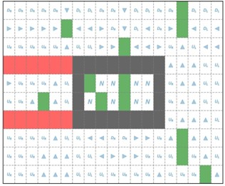
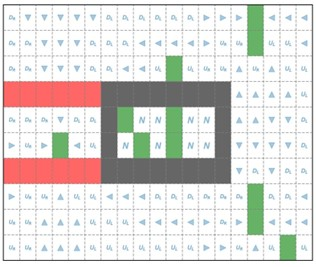
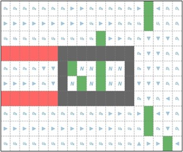
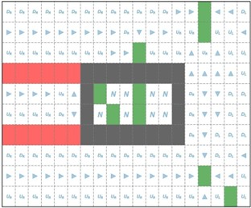
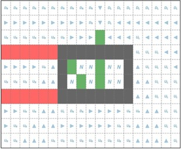

This repository contains a series of images illustrating the evolution of the policy during the Value Iteration process. Each image corresponds to a specific iteration, showcasing how the policy changes and converges over time.

Explore the progression of the policy in the Value Iteration algorithm through the following rounds:

 
**Policy: Round 1**

 
**Policy: Round 7**

 
**Policy: Round 12**

 
**Policy: Round 26**

 
**Policy: Round 42**
